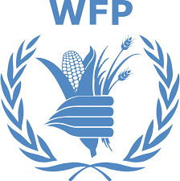
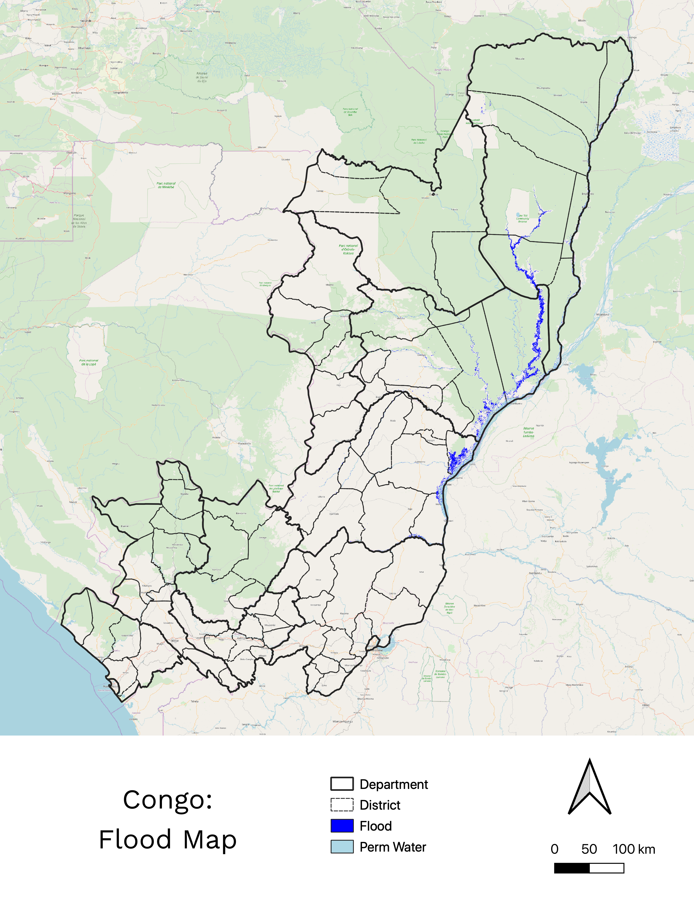

#  Monthly Flood Status Report - February 2020

## Prepared for for the Congo Country Office of the World Food Programme

---
# Flood Status & Impacts Summary This Month
- **Cuvette** is currently the Department with the most flooded area, with an estimated **10,276** people potentially affected
- **Loukolela, Mossaka**, and **Makotimpoko** are currently the top 3 affected Districts by flood area this month.
- **Cuvette** currently is the Department with the most flooded agriculture, while **Loukolela, Mossaka**, and **Liranga** are currently the top 3 affected Districts by flooded agriculture. 
- Over **300 villages** potentially remain submerged based on the detections this month
- **Brazzaville** Department experienced the greatest rainfall according to satellite rainfall estimates **(77.5 mm)**

---
# Flood Status Overview
- Across Likouala, Cuvette, & Plateaux **3,694 km2** remains flooded.

> Source: Sentinel-1
> GRD, Sentinel-2
> MSS, Landsat 8 OLI

{.column}

---
